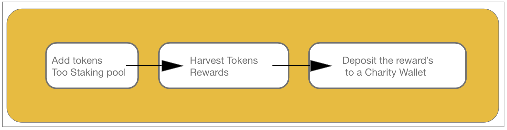
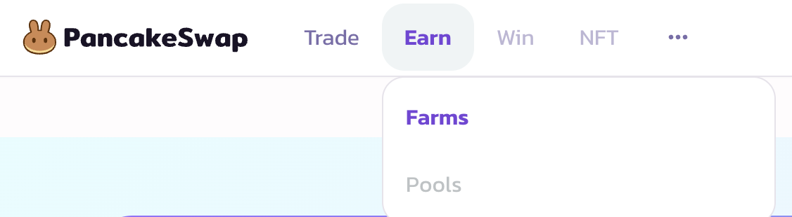
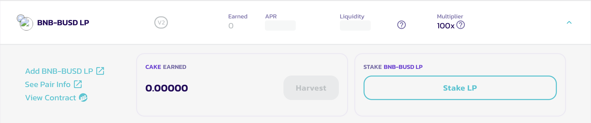
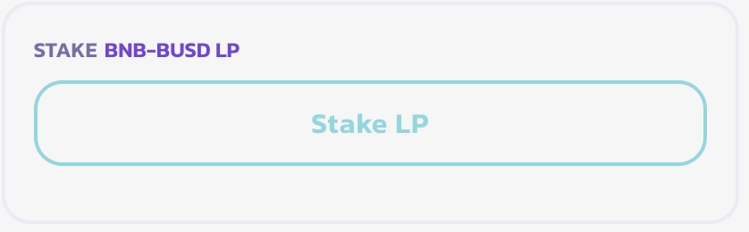
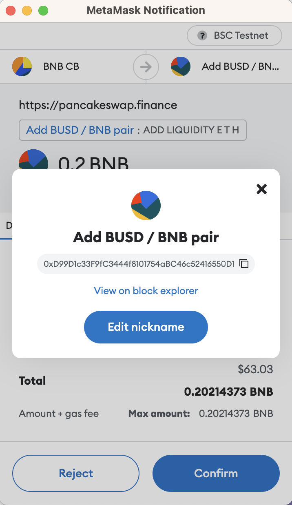
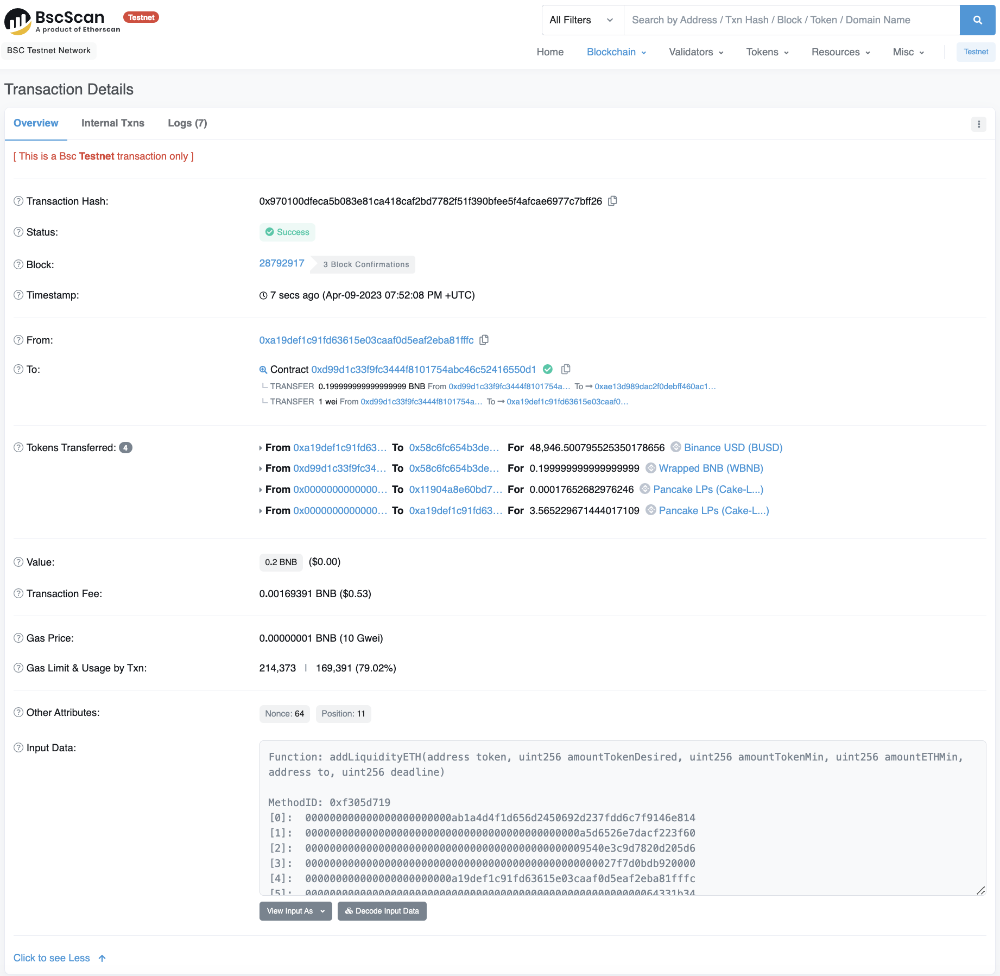
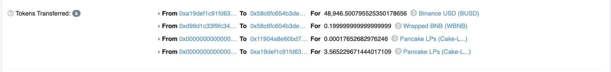
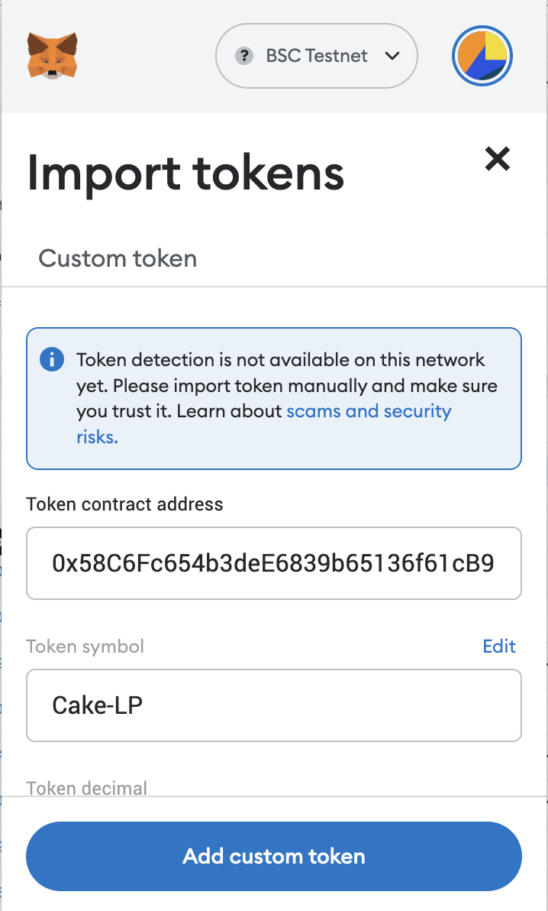
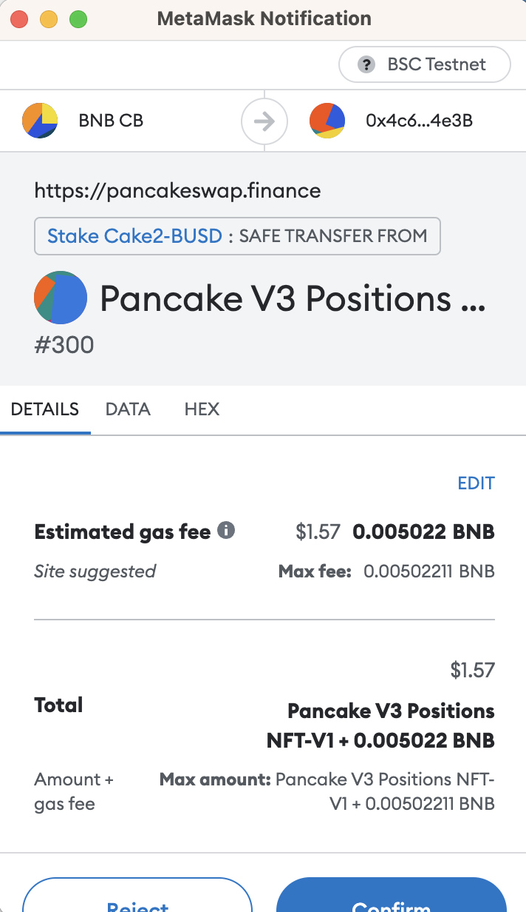
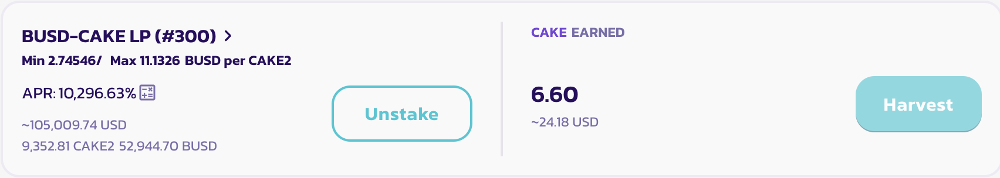

# 06: Interacting with BNB Smart Contracts

1. Open `https://remix.ethereum.org/`
2. Open `https://testnet.bscscan.com/`

##  Create your idea.
3. For this tutorial, we will be doing the following :

1. Open a dApp you like and intercat with the contract's you would like to use in your own application.  

    * For our example, we'll be using pancakeSwap, a Popular Decentralized exchange on the BNB Chain.
    * Select **'Farms'**.
    * Select **'BNB-BUSD LP'**.
    * Select **'View Contract'**.
    * Save the contract's address 
    * Try conducting a transaction with this contract. You will be asked to 'add lp' of this token pair first. we will add the token to our wallet which will give us the ability to stake to this farm. 
    * For the purpose of this tutorial, I added [BUSD/BNB lp tokens](https://testnet.bscscan.com/tx/0x970100dfeca5b083e81ca418caf2bd7782f51f390bfee5f4afcae6977c7bff26) to the wallet. 
    * Check on which contract you interacted with in the block explorer and add the lp token to your wallet to view the BNB/BUSD pair. 
    * **'Stake'** the LP token
    * **'Harvest'** the token
    * **'Swap'** for BNB or BUSD
    * **'Deposit'** to Charity

> - Trouble shoot errors
> - Collect your contract address's 
> - Mind Map your contract's path

---

---

**Contract's Address :** [0x4E96D2e92680Ca65D58A0e2eB5bd1c0f44cAB897](https://testnet.bscscan.com/address/0x4E96D2e92680Ca65D58A0e2eB5bd1c0f44cAB897#code)

---

Interact with this contract's pool.

---

---

We can see that the pairing contract's address is different than the contract that will stake our tokens. You can edit the nickname of this contract to reference for the future to help you save time. 

**for example**
[0xD99D1c33F9fC3444f8101754aBC46c52416550D1](https://testnet.bscscan.com/address/0xd99d1c33f9fc3444f8101754abc46c52416550d1)

---

* Check the input data to discover the function used by the contract you interacted with when adding BNB/BUSD lp token to the wallet. 
* look's like we used the `addLiquidityETH` function.

---

* [We recieved ~3.5 CAKE lp token](https://testnet.bscscan.com/tx/0x970100dfeca5b083e81ca418caf2bd7782f51f390bfee5f4afcae6977c7bff26) for this transaction. 
* Navigate to this token's contract, copy it, and add it to your wallet. 

--- 

* **You should be able to see the CAKE lp token in your wallet now.** 

---

* Stake your LP and then save the transaction hash and contract address

---
* **Harvest the tokens, save the tx has and contract address**

# Trouble Shooting Errors -- 
### *Problems may occur when interacting with contracts on testnet*...
> When We stake our tokens, we interact with the following contract. You may have issues here with pancake swap since not all token pairs may be avaiable for you to interact with at the time of ready this. So please do your own due diligence and see which token pool will allow you to stake your tokens. A good pool to always fall back on is the Chain's native BNB token and the stable token (BUSD) pool. Swap for these two tokens, add the pair, and stake them (same process). 